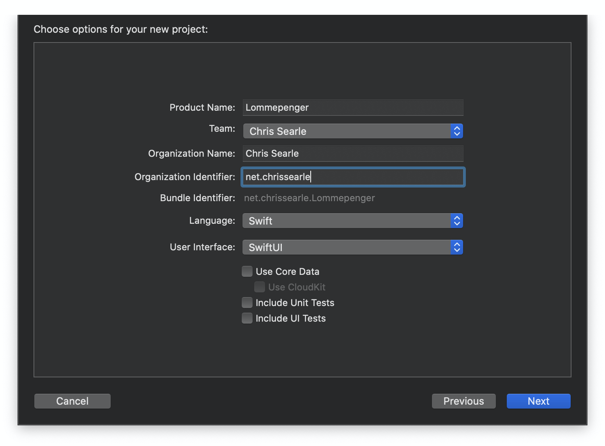
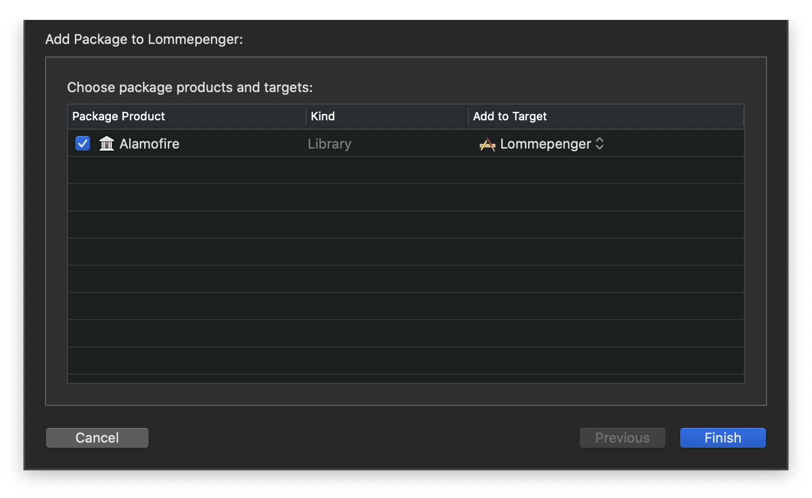

Let's start by getting the correct project setup.

You'll need to be on the latest Xcode (11.3 or so) - and it will be best if you are running Catalina - then we can get the canvas previews in XCode to work.

## Setup

In Xcode - start a new project. Choose iOS and a single view app.

Fill out the project details. In my case - I will end up keeping the same details as the [previous version of the app](https://github.com/chrissearle/Lommepenger/tree/63a3bda3183926a18e821d90c62dc33b807c7e33). Make sure to choose Swift as the language and SwiftUI as the User Interface.



Choose a place to save the project and enable git repository generation.

## .gitignore

Xcode's git setup doesn't create a .gitignore file and it does have a bunch of files that we don't really want checked in. So - let's grab one.

GitHub maintains a really useful [gitignore repository](https://github.com/github/gitignore) with lots of different templates. We'll grab the [Swift](https://github.com/github/gitignore/blob/master/Swift.gitignore) one and save it as .gitignore in the project (add and commit) before we continue.

```shell
$ curl -o .gitignore https://raw.githubusercontent.com/github/gitignore/master/Swift.gitignore
$ git add .gitignore
$ git ci -m "Add .gitignore"
```

## Libraries

Let's finish up the setup with two libraries we already know we want to add.

In Xcode - choose `File > Swift Packages > Add Package Dependency`.

In the package repository url field - enter https://github.com/Alamofire/Alamofire.git and hit next.

For version rule - keep `Up to next major` and next again.

In the final window - make sure that the package is checked off for your app's target and hit finish.



Now do the same with https://github.com/twostraws/CodeScanner

Finally git add and commit the changes.

## Summary

The project is now ready to use - in the next step we'll start by testing out QR code scanning.
